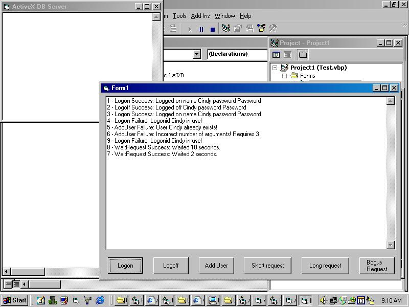



## Asynchronous Database Processing

### Description

Asynchronous Database Processing via Active EXE - When processing thousands of requests for a multi-user real-time application, you cannot afford to wait for the relatively slow database processing to occur. Here's the scenario: You have 1000 people already online and playing your multi-user game, and 10 people in the process of logging on right now. What do you do? You could process the logons right now, searching through thousands of user records, to load up their information - but then the game would appear to 'hang' for everyone already playing, waaaay bogus. You could process only 1 person at a time, in the main processing loop - that's better, but will add unnecessary slowdown to your program. What if you could log on the person in a BACKGROUND process, which wouldn't slow down the existing users? Ooh yeah. Or better yet, hand the request off to a machine across the network, dedicated to database processing? NOW we're talking! :-) You can do this easily, using Visual Basic ActiveX EXE's.

Have fun with it!
 
### More Info
 
You should be familiar with Database Processing in general, and have at least trotted through the 'CoffeeWatch' ActiveX EXE project in the MSDN Online Help, before tackling this project.

             |
---                |---
**Submitted On**   |2001-09-12 18:21:26
**By**             |[Kamilche](https://github.com/Planet-Source-Code/PSCIndex/blob/master/ByAuthor/kamilche.md)
**Level**          |Advanced
**User Rating**    |4.6 (23 globes from 5 users)
**Compatibility**  |VB 6\.0
**Category**       |[Databases/ Data Access/ DAO/ ADO](https://github.com/Planet-Source-Code/PSCIndex/blob/master/ByCategory/databases-data-access-dao-ado__1-6.md)
**World**          |[Visual Basic](https://github.com/Planet-Source-Code/PSCIndex/blob/master/ByWorld/visual-basic.md)
**Archive File**   |[Asynchrono263709132001\.zip](https://github.com/Planet-Source-Code/kamilche-asynchronous-database-processing__1-27205/archive/master.zip)

